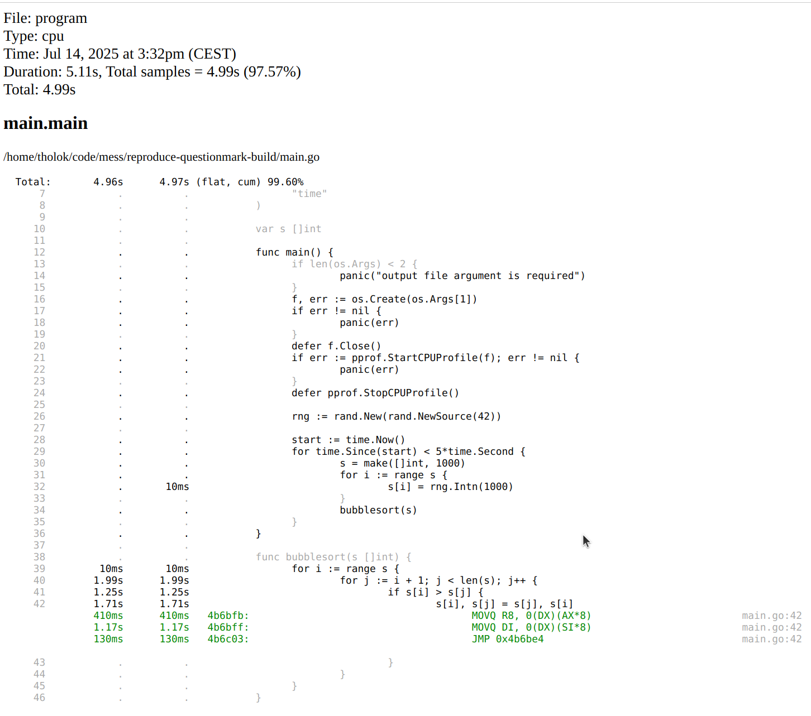
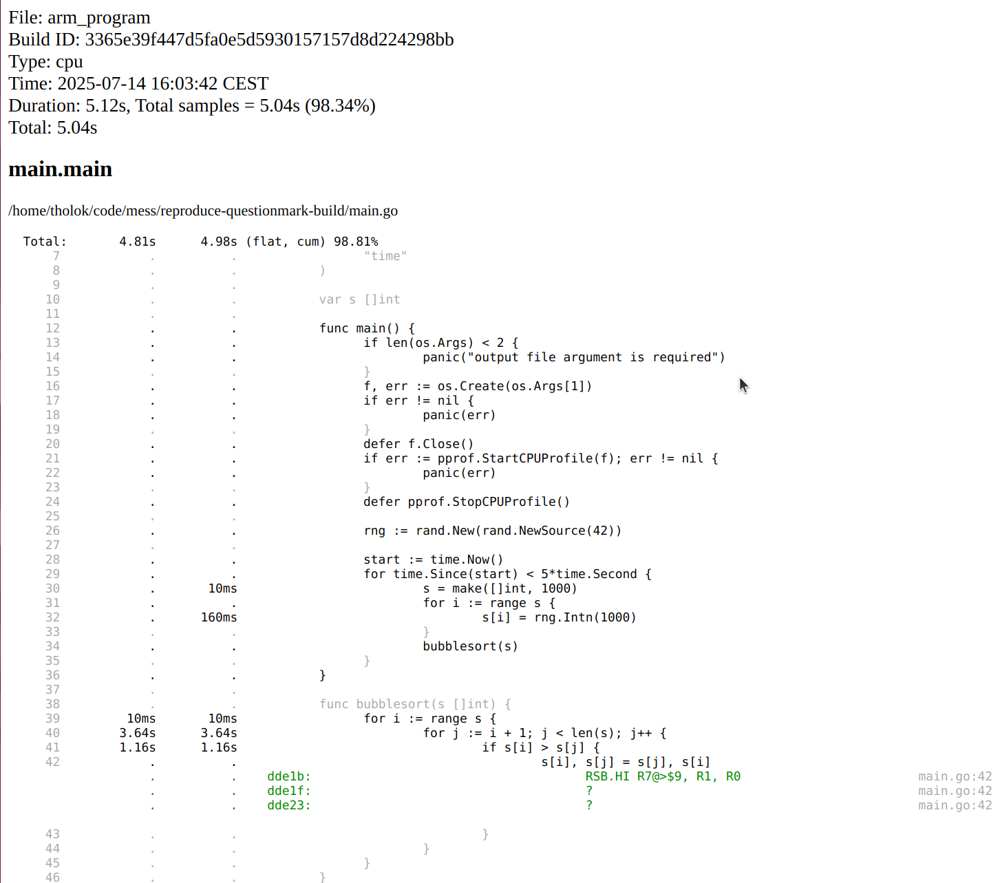
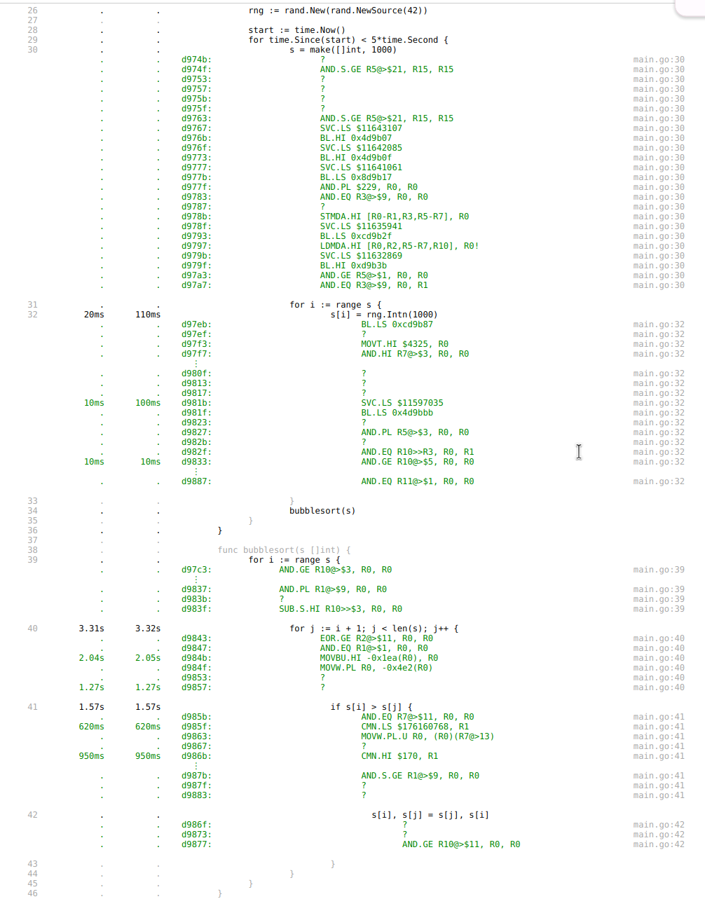
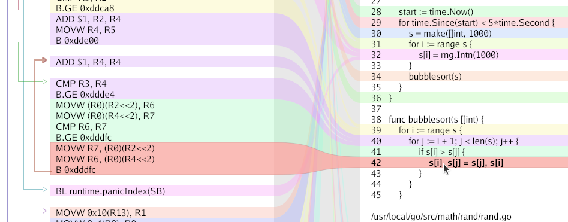

Annotated code in pprof looks wrong when cross compiling for ARMv7. I get question marks and seemingly irrelevant instructions. This repository is an attempt to demonstrate what I am seeing with a minimal example so someone can tell me what I'm doing wrong (or maybe to uncover a bug?).

`main.go` is a short program that does some work while CPU profiling to a file provided as an argument.

### Without cross compilation

```bash
# build executable
go build -o program main.go
# run executable
./program profile.out
# weblist main
go tool pprof -weblist main.main program profile.out
```

Clicking on line 42 we get something that looks reasonable:



### With cross compilation for ARM

```bash
# build executable
GOARCH=arm GOARM=7 go build -o arm_program main.go
# run executable (with qemu)
./arm_program arm_profile.out
# weblist main
go tool pprof -weblist main.main arm_program arm_profile.out
```

Clicking on line 42 we get 2 question mark instructions and a `AND.GE` which doesn't seem related.



Clicking around more we see lots of question marks. Notice that `make([]int, 1000)` on line 30 doesn't even include a call to `runtime.makeslice`.



Inspecting the executable with `go run loov.dev/lensm@main -filter main.main arm_program` shows assembly that looks more like what I expect for line 42:

