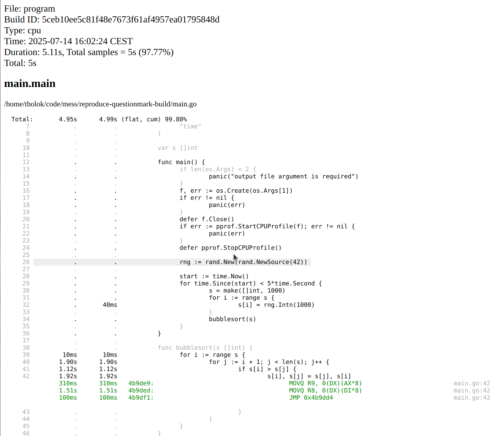
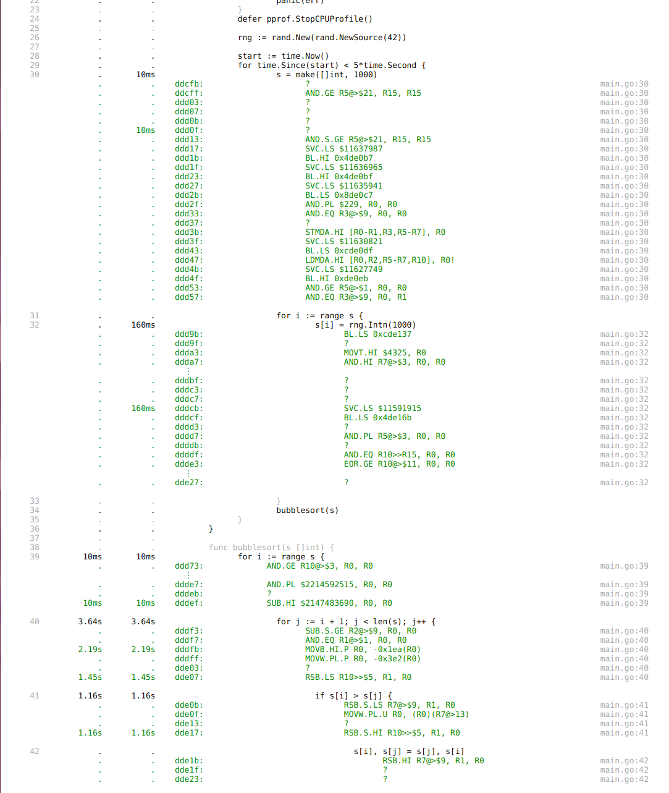

Annotated code in pprof looks wrong when cross compiling for ARMv7. I get question marks and seemingly irrelevant instructions. This repository is an attempt to demonstrate what I am seeing with a minimal example so someone can tell me what I'm doing wrong (or maybe to uncover a bug?).

`main.go` is a short program that does some work while CPU profiling to a file provided as an argument.

**NOTE** I have committed the executables and profiles below, so you can explore them without building and running, and compare in case you get different results when building and running on your machine. 

See end of file for output of `go bug`.

## Without cross compilation

```bash
# build executable
go build -o program main.go
# run executable
./program profile.out
# weblist main
go tool pprof -weblist main.main program profile.out
```

Clicking on line 42 we get something that looks reasonable:



## With cross compilation for ARM

```bash
# build executable
GOARCH=arm GOARM=7 go build -o arm_program main.go
# run executable (with qemu)
./arm_program arm_profile.out
# weblist main
go tool pprof -weblist main.main arm_program arm_profile.out
```

Clicking on line 42 we get 2 question mark instructions and a `RSB.HI`.


Clicking around more we see lots of question marks. Notice that `make([]int, 1000)` on line 30 doesn't even include a call to `runtime.makeslice`.



Inspecting the executable with `go run loov.dev/lensm@main -filter main.main arm_program` shows assembly that looks more like what I expect for line 42:


## Output of `go bug`

<!-- Please answer these questions before submitting your issue. Thanks! -->

### What version of Go are you using (`go version`)?

<pre>
$ go version
go version go1.24.5 linux/amd64
</pre>

### Does this issue reproduce with the latest release?


### What operating system and processor architecture are you using (`go env`)?

<details><summary><code>go env</code> Output</summary><br><pre>
$ go env
AR='ar'
CC='gcc'
CGO_CFLAGS='-O2 -g'
CGO_CPPFLAGS=''
CGO_CXXFLAGS='-O2 -g'
CGO_ENABLED='1'
CGO_FFLAGS='-O2 -g'
CGO_LDFLAGS='-O2 -g'
CXX='g++'
GCCGO='gccgo'
GO111MODULE=''
GOAMD64='v1'
GOARCH='amd64'
GOAUTH='netrc'
GOBIN=''
GOCACHE='/home/redacted/.cache/go-build'
GOCACHEPROG=''
GODEBUG=''
GOENV='/home/redacted/.config/go/env'
GOEXE=''
GOEXPERIMENT=''
GOFIPS140='off'
GOFLAGS=''
GOGCCFLAGS='-fPIC -m64 -pthread -Wl,--no-gc-sections -fmessage-length=0 -ffile-prefix-map=/tmp/go-build1320095087=/tmp/go-build -gno-record-gcc-switches'
GOHOSTARCH='amd64'
GOHOSTOS='linux'
GOINSECURE=''
GOMOD='/home/redacted/code/mess/reproduce-questionmark-build/go.mod'
GOMODCACHE='/home/redacted/go/pkg/mod'
GONOPROXY='github.com/redacted/*'
GONOSUMDB='github.com/redacted/*'
GOOS='linux'
GOPATH='/home/redacted/go'
GOPRIVATE='github.com/redacted/*'
GOPROXY='https://proxy.golang.org,direct'
GOROOT='/usr/local/go'
GOSUMDB='sum.golang.org'
GOTELEMETRY='local'
GOTELEMETRYDIR='/home/redacted/.config/go/telemetry'
GOTMPDIR=''
GOTOOLCHAIN='auto'
GOTOOLDIR='/usr/local/go/pkg/tool/linux_amd64'
GOVCS=''
GOVERSION='go1.24.5'
GOWORK=''
PKG_CONFIG='pkg-config'
uname -sr: Linux 6.8.0-60-generic
Distributor ID:	Ubuntu
Description:	Ubuntu 22.04.3 LTS
Release:	22.04
Codename:	jammy
/lib/x86_64-linux-gnu/libc.so.6: GNU C Library (Ubuntu GLIBC 2.35-0ubuntu3.10) stable release version 2.35.
gdb --version: GNU gdb (Ubuntu 12.1-0ubuntu1~22.04.2) 12.1
</pre></details>

### What did you do?

<!--
If possible, provide a recipe for reproducing the error.
A complete runnable program is good.
A link on play.golang.org is best.
-->


### What did you expect to see?


### What did you see instead?

